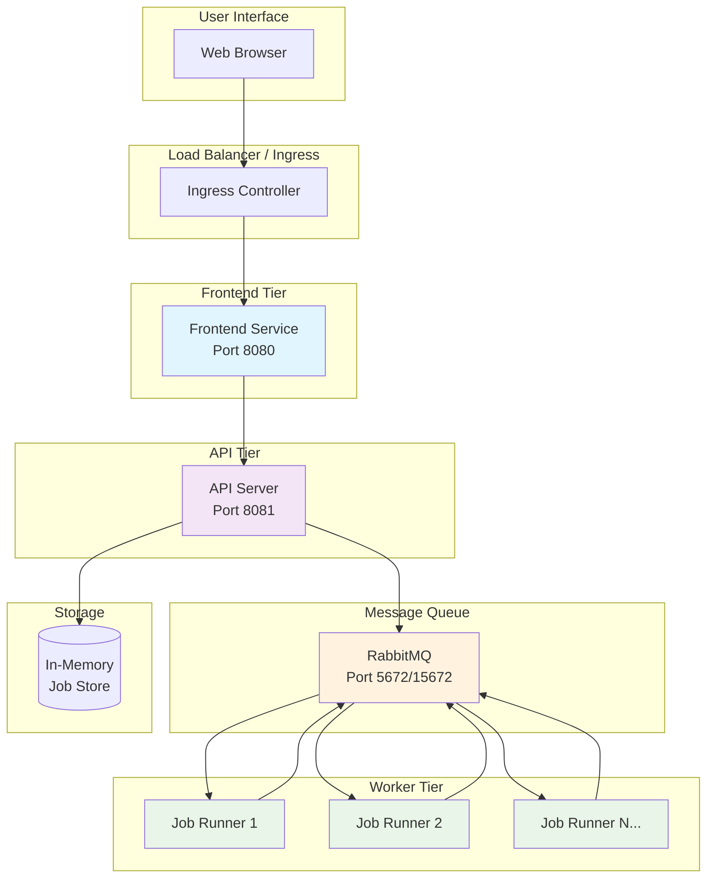
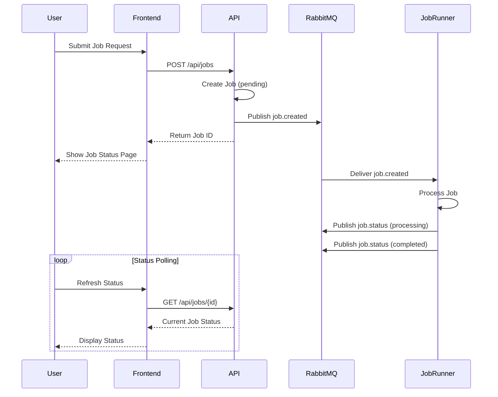
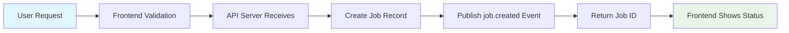
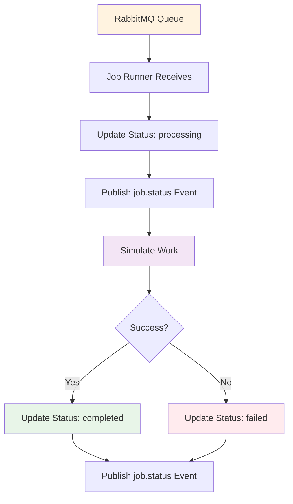
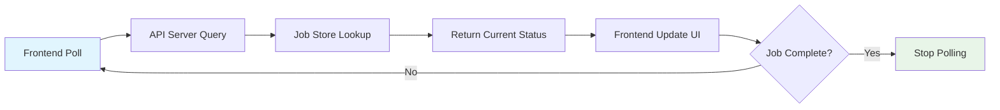

# Architecture Documentation

This document provides a comprehensive overview of the Microservices Demo application architecture, design decisions, and technical implementation details.

## Table of Contents

- [System Overview](#system-overview)
- [Architecture Patterns](#architecture-patterns)
- [Service Design](#service-design)
- [Data Flow](#data-flow)
- [Technology Stack](#technology-stack)
- [Design Decisions](#design-decisions)
- [Scalability Considerations](#scalability-considerations)
- [Security Model](#security-model)

## System Overview

The Microservices Demo is a distributed system that demonstrates modern microservices architecture patterns using Go, RabbitMQ, and containerization technologies.

### High-Level Architecture



### Service Interaction Flow



## Architecture Patterns

### 1. Microservices Architecture

**Implementation:**
- **Service Independence**: Each service has its own codebase, build process, and deployment
- **Domain Separation**: Clear boundaries between presentation, API, and processing concerns
- **Communication**: Asynchronous messaging via RabbitMQ
- **Data Ownership**: Each service manages its own data (API server owns job state)

**Benefits:**
- ✅ Independent deployments and scaling
- ✅ Technology diversity (can use different frameworks per service)
- ✅ Fault isolation (one service failure doesn't cascade)
- ✅ Team autonomy (different teams can own different services)

### 2. Event-Driven Architecture

**Implementation:**
- **Message Broker**: RabbitMQ as central message hub
- **Event Types**: `job.created`, `job.status` events
- **Publisher/Subscriber**: Loose coupling between services
- **Asynchronous Processing**: Non-blocking job execution

**Benefits:**
- ✅ Loose coupling between services
- ✅ High scalability through async processing
- ✅ Event sourcing capabilities (can track all state changes)
- ✅ Easy to add new consumers without modifying publishers

### 3. CQRS (Command Query Responsibility Segregation)

**Implementation:**
- **Commands**: Job creation through API server
- **Queries**: Job status retrieval through API server
- **Separation**: Write operations (commands) trigger events, read operations query current state

**Benefits:**
- ✅ Optimized read/write patterns
- ✅ Clear separation of concerns
- ✅ Easy to add read replicas or caching

### 4. Hexagonal Architecture (Ports and Adapters)

**Implementation:**
Each service follows hexagonal architecture:
- **Core Business Logic**: Independent of external dependencies
- **Ports**: Interfaces for external communication
- **Adapters**: Concrete implementations (HTTP handlers, RabbitMQ clients)

```
┌─────────────────────────────────────┐
│              Service                │
│  ┌─────────────────────────────┐    │
│  │      Business Logic         │    │
│  │                             │    │
│  └─────────────────────────────┘    │
│           ↑           ↑             │
│      Port │           │ Port        │
│           ↓           ↓             │
│  ┌─────────────┐ ┌─────────────┐    │
│  │HTTP Adapter │ │ AMQP Adapter│    │
│  └─────────────┘ └─────────────┘    │
└─────────────────────────────────────┘
```

## Service Design

### Frontend Service

**Responsibilities:**
- User interface presentation
- Form handling and validation
- API client for backend communication
- Real-time status updates via polling

**Architecture:**
```go
// Simplified structure
type Frontend struct {
    APIClient     *http.Client
    Templates     *template.Template
    StaticAssets  http.FileSystem
}

type Handlers struct {
    frontend *Frontend
}
```

**Design Patterns:**
- **Template Pattern**: Go templates for HTML rendering
- **Adapter Pattern**: HTTP client adapter for API communication
- **Observer Pattern**: Polling-based status updates

### API Server

**Responsibilities:**
- REST API endpoint management
- Job lifecycle management
- Message queue integration
- Request validation and error handling

**Architecture:**
```go
// Simplified structure
type APIServer struct {
    JobStore    JobRepository
    MessageBus  MessagePublisher
    Router      *gin.Engine
}

type JobService struct {
    store       JobRepository
    messageBus  MessagePublisher
}
```

**Design Patterns:**
- **Repository Pattern**: Abstract data access layer
- **Publisher Pattern**: Event publishing to message queue
- **Dependency Injection**: Testable service components
- **Middleware Pattern**: Cross-cutting concerns (logging, CORS)

### Job Runner

**Responsibilities:**
- Job queue consumption
- Job processing simulation
- Status update publishing
- Error handling and retry logic

**Architecture:**
```go
// Simplified structure
type JobRunner struct {
    MessageBus  MessageConsumer
    Processor   JobProcessor
    Config      ProcessorConfig
}

type JobProcessor interface {
    Process(ctx context.Context, job Job) error
}
```

**Design Patterns:**
- **Consumer Pattern**: Message queue consumption
- **Strategy Pattern**: Different processing strategies based on job type
- **Circuit Breaker**: Fault tolerance for external dependencies
- **Worker Pool**: Concurrent job processing

### Shared Package

**Responsibilities:**
- Common data models
- Message queue utilities
- Configuration helpers
- Shared business logic

**Architecture:**
```go
// Core types
type Job struct {
    ID          string
    Description string
    Status      JobStatus
    // ... other fields
}

type MessageBus interface {
    Publish(event Event) error
    Subscribe(handler EventHandler) error
}
```

## Data Flow

### 1. Job Creation Flow



### 2. Job Processing Flow



### 3. Status Update Flow



## Technology Stack

### Core Technologies

| Component | Technology | Version | Purpose |
|-----------|------------|---------|---------|
| **Runtime** | Go | 1.21+ | Primary programming language |
| **Web Framework** | Gin | Latest | HTTP server and routing |
| **Message Broker** | RabbitMQ | 3.12 | Asynchronous messaging |
| **Containerization** | Docker | Latest | Service packaging |
| **Orchestration** | Kubernetes | 1.25+ | Container orchestration |
| **CI/CD** | GitHub Actions | Latest | Automated testing and deployment |

### Supporting Libraries

| Library | Purpose | Service |
|---------|---------|---------|
| `github.com/gin-gonic/gin` | HTTP web framework | API Server, Frontend |
| `github.com/streadway/amqp` | RabbitMQ client | All services |
| `github.com/google/uuid` | UUID generation | API Server |
| `html/template` | HTML templating | Frontend |
| `net/http` | HTTP client | Frontend |

### Infrastructure

```yaml
# Production stack
Infrastructure:
  Load Balancer: Kubernetes Ingress Controller
  Service Mesh: Optional (Istio for advanced scenarios)
  Monitoring: Prometheus + Grafana
  Logging: ELK Stack or similar
  Storage: Persistent volumes for RabbitMQ
  Secrets: Kubernetes Secrets
```

## Design Decisions

### 1. Go as Primary Language

**Decision:** Use Go for all microservices

**Rationale:**
- ✅ **Performance**: Compiled language with excellent concurrency
- ✅ **Simplicity**: Small language specification, easy to learn
- ✅ **Cloud-Native**: Excellent ecosystem for microservices
- ✅ **Cross-Platform**: Easy Docker containerization

**Trade-offs:**
- ➖ Learning curve for teams unfamiliar with Go
- ➖ Less mature ecosystem compared to Java/Python in some areas

### 2. RabbitMQ for Message Broker

**Decision:** Use RabbitMQ instead of alternatives (Kafka, Redis, etc.)

**Rationale:**
- ✅ **Mature**: Battle-tested message broker
- ✅ **Feature-Rich**: Routing, exchanges, dead letter queues
- ✅ **Developer Experience**: Excellent management UI
- ✅ **Operational**: Good monitoring and troubleshooting tools

**Trade-offs:**
- ➖ Higher memory usage compared to simpler solutions
- ➖ More complex setup than Redis pub/sub

### 3. In-Memory Job Storage

**Decision:** Use in-memory storage instead of persistent database

**Rationale:**
- ✅ **Simplicity**: No database setup or management
- ✅ **Performance**: Fastest possible data access
- ✅ **Demo Focus**: Keeps focus on microservices patterns

**Trade-offs:**
- ➖ Data loss on service restart
- ➖ Not suitable for production use
- ➖ No persistence across deployments

### 4. Synchronous Frontend-API Communication

**Decision:** Use HTTP calls instead of WebSockets or Server-Sent Events

**Rationale:**
- ✅ **Simplicity**: Standard HTTP patterns
- ✅ **Compatibility**: Works with all browsers and proxies
- ✅ **Debugging**: Easy to troubleshoot HTTP requests

**Trade-offs:**
- ➖ Polling overhead for real-time updates
- ➖ Less responsive than push-based updates

### 5. Single-Binary Deployments

**Decision:** Each service is a single binary with embedded assets

**Rationale:**
- ✅ **Deployment Simplicity**: Single artifact per service
- ✅ **Container Optimization**: Minimal container images
- ✅ **Dependency Management**: No external file dependencies

**Trade-offs:**
- ➖ Larger binary size with embedded assets
- ➖ Rebuild required for asset changes

## Scalability Considerations

### Horizontal Scaling

#### API Server Scaling
```yaml
# Kubernetes deployment
replicas: 3
resources:
  requests:
    memory: "64Mi"
    cpu: "250m"
  limits:
    memory: "128Mi"
    cpu: "500m"
```

**Scaling Strategy:**
- **Stateless**: API servers are completely stateless
- **Load Balancing**: Standard round-robin or least connections
- **Auto-scaling**: HPA based on CPU/memory usage

#### Job Runner Scaling
```yaml
# Kubernetes deployment
replicas: 5
resources:
  requests:
    memory: "32Mi"
    cpu: "100m"
  limits:
    memory: "64Mi"
    cpu: "200m"
```

**Scaling Strategy:**
- **Queue-Based**: Scale based on RabbitMQ queue depth
- **Work Distribution**: RabbitMQ handles work distribution automatically
- **Resource-Based**: Scale based on job processing requirements

#### Frontend Scaling
- **CDN**: Static assets can be served from CDN
- **Multiple Replicas**: Standard web server scaling patterns
- **Session Affinity**: Not required (stateless)

### Vertical Scaling

#### Memory Considerations
- **API Server**: Scales with number of concurrent jobs in memory
- **Job Runner**: Memory per concurrent job processing
- **RabbitMQ**: Scales with queue depth and message retention

#### CPU Considerations
- **API Server**: Primarily I/O bound, minimal CPU requirements
- **Job Runner**: CPU bound during job simulation
- **Frontend**: Minimal CPU for template rendering

### Performance Characteristics

#### Throughput
- **Job Creation**: 1000+ jobs/second with multiple API server instances
- **Job Processing**: Limited by job simulation time (5-60 seconds per job)
- **Status Queries**: 5000+ requests/second with load balancing

#### Latency
- **API Response Time**: < 10ms for job creation/status queries
- **End-to-End Processing**: 5-60 seconds (simulated work time)
- **Frontend Response**: < 100ms for page loads

## Security Model

### Current Security Posture

**Authentication:** None (demo application)
**Authorization:** None (open access)
**Transport Security:** HTTP (not HTTPS in demo)
**Network Security:** Kubernetes network policies (in K8s deployment)

### Production Security Recommendations

#### 1. Authentication & Authorization
```yaml
# Recommended additions
Authentication:
  - JWT tokens for API access
  - OAuth2/OIDC integration
  - Service-to-service mTLS

Authorization:
  - RBAC for different user types
  - API rate limiting
  - Job ownership validation
```

#### 2. Network Security
```yaml
# Kubernetes network policies
Network_Security:
  - Frontend → API Server only
  - API Server → RabbitMQ only
  - Job Runner → RabbitMQ only
  - No direct frontend → RabbitMQ access
```

#### 3. Data Security
```yaml
# Data protection measures
Data_Security:
  - Encrypt data at rest
  - Encrypt inter-service communication
  - Audit logging for all operations
  - Input validation and sanitization
```

#### 4. Container Security
```yaml
# Container hardening
Container_Security:
  - Non-root user execution
  - Read-only root filesystem
  - Minimal base images (distroless)
  - Regular security scanning
```

## Monitoring and Observability

### Metrics Collection
```yaml
# Recommended metrics
Application_Metrics:
  - Job creation rate
  - Job processing duration
  - Queue depth
  - Error rates
  - Response times

System_Metrics:
  - CPU/Memory usage
  - Network I/O
  - Disk I/O
  - Container health
```

### Logging Strategy
```yaml
# Structured logging
Log_Levels:
  - ERROR: Application errors
  - WARN: Recoverable issues
  - INFO: Important events (job lifecycle)
  - DEBUG: Detailed troubleshooting

Log_Format:
  - JSON structured logs
  - Correlation IDs for request tracing
  - Contextual information (service, version)
```

### Distributed Tracing
```yaml
# Tracing implementation
Tracing:
  - OpenTelemetry instrumentation
  - Trace job lifecycle across services
  - Performance bottleneck identification
  - Error correlation across services
```

---

## Related Documentation

- [API Documentation](API.md) - Detailed API endpoint reference
- [Deployment Guide](DEPLOYMENT.md) - Production deployment strategies
- [Development Guide](DEVELOPMENT.md) - Local development setup
- [CI/CD Documentation](CICD.md) - Pipeline and automation details
