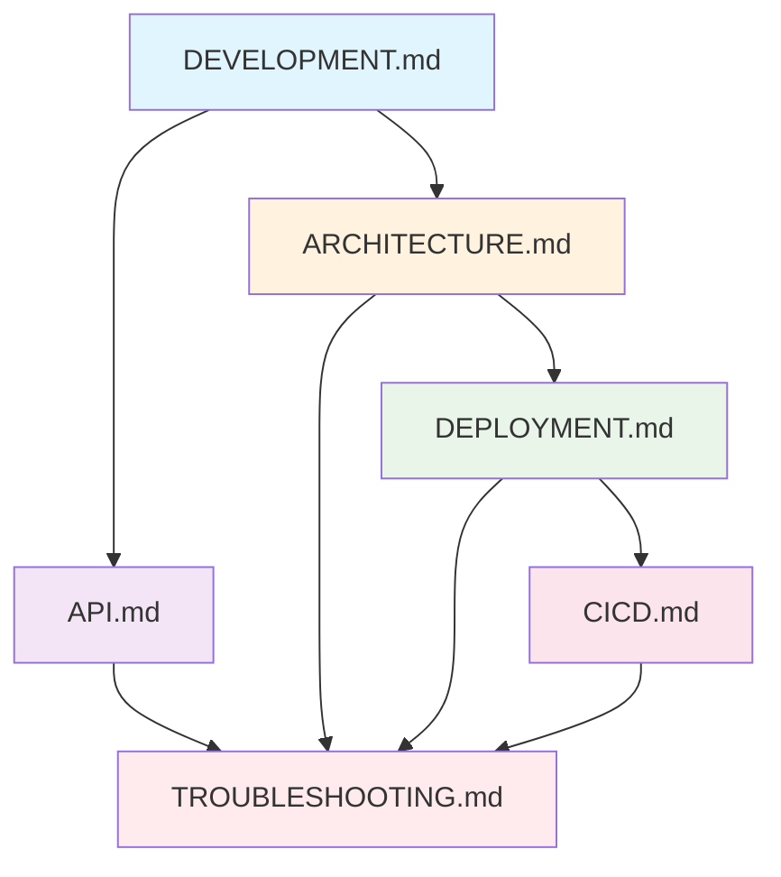

# Documentation

This directory contains comprehensive documentation for the Microservices Demo application.

## 📋 Documentation Overview

| Document | Description | Audience |
|----------|-------------|----------|
| **[API.md](API.md)** | Complete REST API reference with examples | Developers, API consumers |
| **[ARCHITECTURE.md](ARCHITECTURE.md)** | System design, patterns, and technical decisions | Architects, Senior developers |
| **[CICD.md](CICD.md)** | CI/CD pipeline, GitHub Actions, automation | DevOps, Platform engineers |
| **[DEVELOPMENT.md](DEVELOPMENT.md)** | Local development setup and workflows | Developers, Contributors |
| **[DEPLOYMENT.md](DEPLOYMENT.md)** | Production deployment strategies | DevOps, Site reliability engineers |
| **[TROUBLESHOOTING.md](TROUBLESHOOTING.md)** | Issue diagnosis and resolution | All team members |

## 🚀 Quick Start Guide

### For Developers
1. **Start here**: [DEVELOPMENT.md](DEVELOPMENT.md) - Set up your local environment
2. **API Reference**: [API.md](API.md) - Understand the endpoints and data models
3. **System Understanding**: [ARCHITECTURE.md](ARCHITECTURE.md) - Learn the system design

### For DevOps/Platform Engineers
1. **Start here**: [DEPLOYMENT.md](DEPLOYMENT.md) - Deploy to various environments
2. **Automation**: [CICD.md](CICD.md) - Understand the CI/CD pipeline
3. **Operations**: [TROUBLESHOOTING.md](TROUBLESHOOTING.md) - Handle production issues

### For Product Managers/Stakeholders
1. **System Overview**: [ARCHITECTURE.md#system-overview](ARCHITECTURE.md#system-overview)
2. **API Capabilities**: [API.md#overview](API.md#overview)
3. **Deployment Options**: [DEPLOYMENT.md#deployment-overview](DEPLOYMENT.md#deployment-overview)

## 📖 Document Relationships



## 🔍 Find What You Need

### Common Scenarios

#### "I want to start developing"
→ [DEVELOPMENT.md](DEVELOPMENT.md) + [API.md](API.md)

#### "I need to deploy this to production"
→ [DEPLOYMENT.md](DEPLOYMENT.md) + [CICD.md](CICD.md)

#### "Something is broken"
→ [TROUBLESHOOTING.md](TROUBLESHOOTING.md)

#### "I need to understand the system"
→ [ARCHITECTURE.md](ARCHITECTURE.md)

#### "I want to integrate with the API"
→ [API.md](API.md)

#### "I need to modify the CI/CD pipeline"
→ [CICD.md](CICD.md)

### Search by Topic

#### **Local Development**
- [Development Environment Setup](DEVELOPMENT.md#development-environment)
- [Hot Reloading](DEVELOPMENT.md#hot-reloading-setup)
- [Testing Strategy](DEVELOPMENT.md#testing-strategy)

#### **API Integration**
- [API Endpoints](API.md#api-server-endpoints)
- [Data Models](API.md#data-models)
- [Error Handling](API.md#error-handling)
- [Examples](API.md#examples)

#### **System Design**
- [Architecture Patterns](ARCHITECTURE.md#architecture-patterns)
- [Service Design](ARCHITECTURE.md#service-design)
- [Technology Stack](ARCHITECTURE.md#technology-stack)

#### **Production Deployment**
- [Kubernetes Deployment](DEPLOYMENT.md#kubernetes-deployment)
- [Docker Deployment](DEPLOYMENT.md#docker-deployment)
- [Security Hardening](DEPLOYMENT.md#security-hardening)

#### **CI/CD Pipeline**
- [Workflow Details](CICD.md#workflow-details)
- [Configuration](CICD.md#configuration)
- [Local CI/CD Simulation](CICD.md#local-development)

#### **Troubleshooting**
- [Quick Diagnostics](TROUBLESHOOTING.md#quick-diagnostics)
- [Common Issues](TROUBLESHOOTING.md#common-issues)
- [Recovery Procedures](TROUBLESHOOTING.md#recovery-procedures)

## 📝 Documentation Standards

### Writing Guidelines
- **Clear headings**: Use descriptive, hierarchical headings
- **Code examples**: Include working, tested code snippets
- **Cross-references**: Link to related sections and documents
- **Practical focus**: Emphasize actionable information
- **Version awareness**: Note version-specific information

### Code Block Standards
```bash
# Always include comments explaining the purpose
command --with-options

# Show expected output when helpful
$ kubectl get pods
NAME                          READY   STATUS    AGE
api-server-7d4b8f9c5d-2x4k8   1/1     Running   5m
```

### Maintenance
- **Regular updates**: Documentation is updated with each release
- **Accuracy verification**: Code examples are tested with CI/CD
- **Community contributions**: Pull requests welcome for improvements
- **Feedback integration**: Documentation evolves based on user feedback

## 🤝 Contributing to Documentation

### Making Changes
1. **Small fixes**: Edit files directly via GitHub web interface
2. **Larger changes**: Follow the development workflow in [DEVELOPMENT.md](DEVELOPMENT.md)
3. **New sections**: Maintain the existing structure and cross-reference other documents

### Documentation Testing
```bash
# Test all code examples
./scripts/test-documentation.sh

# Validate markdown syntax
markdownlint docs/

# Check for broken links
markdown-link-check docs/*.md
```

### Style Guide
- Use **bullet points** for lists
- Use **tables** for structured comparisons
- Use **code blocks** with appropriate language highlighting
- Use **callouts** (✅ ❌ ⚠️) for important information
- Include **mermaid diagrams** for complex relationships

## 📞 Getting Help

### If Documentation is Unclear
1. **Check**: [TROUBLESHOOTING.md](TROUBLESHOOTING.md) for common issues
2. **Search**: Use Ctrl+F to search within documents
3. **Cross-reference**: Check related documents for additional context
4. **Ask**: Create an issue describing what's unclear

### If You Find Errors
1. **Quick fix**: Submit a pull request with the correction
2. **Report**: Create an issue describing the error
3. **Suggest**: Propose improvements to unclear sections

---

## 📊 Documentation Metrics

### Coverage
- ✅ **API Documentation**: Complete with examples
- ✅ **Architecture**: Comprehensive system design
- ✅ **Development**: Full local setup guide
- ✅ **Deployment**: Multiple environment strategies
- ✅ **CI/CD**: Complete pipeline documentation
- ✅ **Troubleshooting**: Common issues and solutions

### Maintenance Status
- **Last Updated**: Regularly maintained with each release
- **Accuracy**: Code examples tested in CI/CD
- **Completeness**: All major system components documented
- **Usability**: User feedback incorporated

---

*For the most up-to-date documentation, always refer to the latest version in the repository.*
